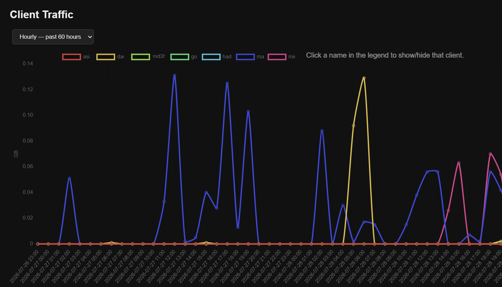

# 3x-ui Traffic Analyzer


A lightweight traffic monitoring tool for **3x-ui** that generates hourly and daily client traffic reports and visualizes them in interactive charts.
> **Note:** Tested and verified with **3x-ui v3.4.0**. Compatibility with newer versions is not guaranteed and may require code updates if the database schema changes.

### Features

- Hourly and daily traffic reports
- Interactive traffic charts; show/hide client lines by clicking their names in the chart legend

### Installation

1. Copy the following files into the **3x-ui database** directory: {index.html, server.py, snapshot.py}

2. Make sure all clients' traffic is reset daily at **00:00**.

3. Add the following cron job:

```cron
55 * * * * /usr/bin/python3 /path/to/snapshot.py
```

4. Start the server:

```bash
python3 server.py
```


#### Screenshot:


